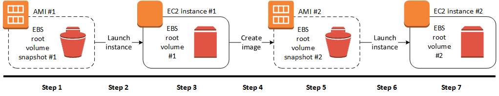
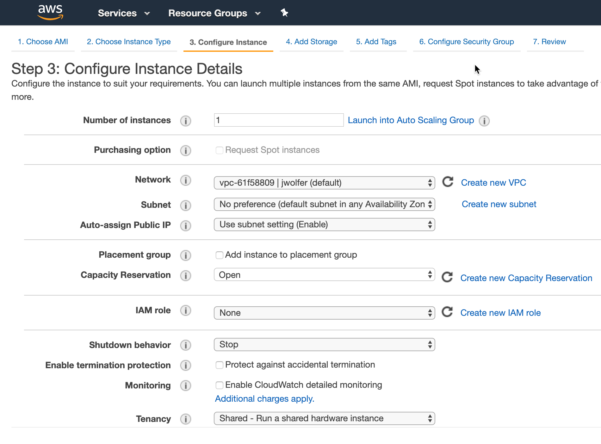
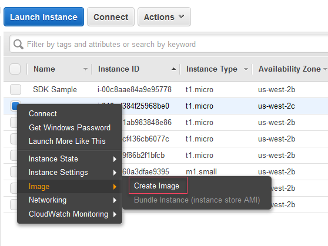

name: packer-field-workshops-slides
class: title, shelf, no-footer, fullbleed
background-image: url(https://joetitra.github.io/field-workshops-assets/assets/bkgs/HashiCorp-Trace3-Title-bkg.jpeg)
count: false

.white[
# Introduction to Packer Workshop
## Define and Create AWS AMIs
]


???
INSTRUCTOR GUIDE LINK: https://github.com/joetitra/field-workshops-packer/blob/main/instructor-guides/Packer_Foundations_INSTRUCTOR_GUIDE.md

This slide presentation is stored as Markdown code, specifically using the RemarkJS engine to render it. All standard markdown tags are supported, and you can also use some HTML within this document.

If you need to change the look and feel of the slide deck just use the style.css and remark_settings.js files to suit your needs. The content in this file is picked up by index.html when the page is loaded.

HTML comments like this one will show up in the source code, but not in the slides or speaker notes.
--->

Welcome to the beginner's guide to Packer. This slide deck is written entirely in Markdown language, which means you can make edits or additions, then submit a pull request to add your changes to the main branch. To make edits to the slide deck simply fork this repository, edit the Markdown files, and submit a pull request with your changes.

The Markdown content is contained in the docs/ subdirectories.

Here are some helpful keyboard shortcuts for the instructor or participant:

⬆ ⬇ ⬅ ➡ - Navigate back and forth
P         - Toggle presenter view
C         - Pop an external window for presentation

Instructor notes are included in plain text, narrative parts are in **bold**. You can use the narrative quotes or change them to suit your own presentation style.

---
layout: true

.footer[
- Copyright © 2021 Trace3 / HashiCorp
- 
]

---
name: Introductions
# Introductions
- Your Name
- Job Title
- Automation Experience
- Favorite Text Editor

???
Use this slide to introduce yourself, give a little bit of your background story, then go around the room and have all your participants introduce themselves.

The favorite text editor question is a good ice breaker, but perhaps more importantly it gives you an immediate gauge of how technical your users are.

**There are no wrong answers to this question. Unless you say Notepad. Friends don't let friends write code in Notepad.**

**If you don't have a favorite text editor, that's okay! Our cloud lab has Visual Studio Code preinstalled. VSC is a free programmer's text editor for Microsoft, and it has great Packer support. Most of this workshop will be simply copying and pasting code, so if you're not a developer don't fret. Packer is easy to learn and fun to work with.**

---
name: Table-of-Contents
# Table of Contents

1. Introduction to Packer
1. How Packer Works
1. Packer Basics<br>
👩‍🔬 **Lab - Setup and Basic Usage**
1. Provision and Configure AMIs<br>
🧪 **Lab - Provisioning with Packer**
1. Organizing Your Packer Code<br>
🔬 **Lab - Advanced Packer Templating**
1. CI/CD Integration

???
This workshop should take roughly two hours to complete.

**Here is our agenda for today's training. The format is simple, you'll hear a lecture and view slides on each topic, then participate in a hands-on lab about that topic. We'll alternate between lecture and lab, with a couple of breaks thrown in.**

---
name: intro-to-packer-demo
class: title
# Chapter 1
## Introduction to Packer

???
We use the word chapter here, because the training should feel like a story unfolding. The instructor's job is to guide the learners through this interactive story.

---
name: How-to-Provision-an-AMI
# How to Create an Amazon EBS-backed AMI

Let's look at a few different ways you could provision a new AMI. Before we start we'll need to gather some basic information including (but not limited to):

- Operating System (Source Image)
- Instance Name
- VM Size
- Geographical Location (Region)
- Security Groups

???
**Has anyone got experience using AWS? How do most of us normally get started? That's right, we log onto the AWS Console and start clicking around. All of the major cloud providers make this part really easy. You get your account, log on and start clicking buttons. Let's take a peek at what that looks like...**

We chose the AWS Console as a starting point because most AWS users will be familiar with it. From this familiar starting point we begin our journey...

---
name: AWS-AMI-Creation
# Steps to Create a New AMI


.center[The process to create a custom AMI in AWS.]

???
**This is the process for custom AMI creation in AWS.**

---

name: AWS-Console-Provision-1
# Method 1: AWS Console (GUI)


???
**This should look familiar if you've ever used AWS. From the EC2 Panel, you click on Instances > Launch Instance, and you'll see a list of different AWS Machine Images (AMIs) you can use to provision your Instance. Some of these are provided by AWS, others are provided by third parties in the marketplace. You either search or browse for the thing you need, and click on it. Easy.**

---

name: AWS-Console-Provision-2
# Method 1: AWS Console (GUI)


???
**Once you've chosen your AMI, you will fill in some more details - the instance type, the VPC you want it to launch in, any associated IAM roles you want to assign it, external storage, tags, security groups... it's a long list of options! The AWS console can be handy for spinning up individual VMs and dev or test environments. The good news is that it's really easy to spin up infrastructure this way. The bad news is that it doesn't scale, and chances are that nobody is keeping track of what got built.**

It's really easy to make a big mess of things if you simply give everyone a console account and turn them loose in the cloud environment.

---

name: AWS-Console-Provision-3
# Method 1: AWS Console (GUI)


???
**Once you've chosen your AMI, you will fill in some more details - the instance type, the VPC you want it to launch in, any associated IAM roles you want to assign it, external storage, tags, security groups... it's a long list of options! The AWS console can be handy for spinning up individual VMs and dev or test environments. The good news is that it's really easy to spin up infrastructure this way. The bad news is that it doesn't scale, and chances are that nobody is keeping track of what got built.**

It's really easy to make a big mess of things if you simply give everyone a console account and turn them loose in the cloud environment.

---
name: Provision-with-CLI
# Method 2: Provision with AWS CLI
```bash
aws ec2 describe-images \
    --owners amazon \
    --filters "Name=platform,Values=linux" "Name=root-device-type,Values=ebs"
aws ec2 run-instances \
    --image-id ami-0abcdef1234567890 \
    --instance-type t2.micro \
    --count 1 \
    --subnet-id subnet-08fc749671b2d077c \
    --key-name MyKeyPair \
    --security-group-ids sg-0b0384b66d7d692f9 \
    --credit-specification CpuCredits=unlimited
...
#connect to instance
#configuration instance
#validate configurations
#run post configuration tasks
#clean instance
...
aws ec2 create-image \
    --instance-id i-1234567890abcdef0 \
    --name "My server" \
    --description "An AMI for my server"
```
.center[Example pseudo code to create an AMI.]

???
**This process requires individual code to find the source AMI, launch and instance from it, additional configurations, and finally creating the AMI from it.**

---
name: Provision-with-Packer
# Method 3: Provision with Packer
```packer
source "amazon-ebs" "example" {
  ami_name      = "learn-packer-linux-aws"
  instance_type = "t2.micro"
  region        = "us-west-2"
  source_ami    =  "ami-fce3c696"
  ssh_username = "ubuntu"
}
```
.center[Example Packer code for building an AMI.]

???
**Packer uses a Domain Specific Language, or DSL that is designed to be both human-friendly and machine-readable. This is an example snippet of Packer code. Would you rather have to write and maintain an entirely custom script that would rely on a series of AWS CLI commands to find your desired base AMI, launch an EC2 instance from it, configure that instance, and then convert it to an AMI.  Or would you prefer this simple, compact packer code?**

Advance back to the previous slide to illustrate the difference between AWS CLI pseudo code and equivalent Packer.

---
name: What-is-Packer
# What is Packer?
* Executable Documentation
* Human and machine readable
* Easy to learn
* Test, share, re-use, automate
* Works on all major cloud providers


???
**So what exactly _is_ Packer? Packer is the DNA of your hybrid infrastructure. Packer code is written in HCL, or HashiCorp Config Language. It is the only programming language designed specifically for provisioning infrastructure on any platform.**

**Do any of you have a wiki or set of runbooks that contain provisioning instructions? Think for a moment about that wiki. Now I want you to imagine the date stamp, when was this thing last edited? Let's say it was four years ago. Do you think maybe something could have changed in the past four years?**

**It sounds funny but the truth is your wiki is the obituary of the last known state of your infrastructure. One of the main reasons to use packer is because it is self-documenting. The code itself explains every step required to build this infrastructure, and therefore it is always up to date.**

---
name: IaC
# What is Infrastructure as Code?
<br><br>
.biglist[
Infrastructure as Code (IaC) is the process of managing and provisioning cloud infrastructure with machine-readable definition files.

**Think of it as executable documentation.**
]

???
**You might be thinking...why can't I just do this by hand? After all the AWS portal is really easy, and I can just stand up my infrastructure manually. Here's why:**

**Packer ensures that when you build any type of infrastructure that it gets built correctly every single time, exactly the same way. Let's try a thought experiment. If I gave every single one of you the same build document and asked you to set up a server, I guarantee there will be differences in those machines when you hand them over. They may not be major differences, but over time these can pile up and cause all sorts of uncertainty and issues in your environment.**

**When you require hands on keyboards (or mice), and you start making changes and manual steps on your infrastructure, you've lost the automation battle before it even starts. Even a single manual step can slow down your delivery schedule, and introduce unnecessary risk and change to your environments.**

---
name: IaC2
# Infrastructure as Code Allows Us To...
???
**We sometimes call this philosophy 'Infrastructure as Code', or the practice of expressing all of our provisioning steps as machine-readable code and variables. This is also known as the...**

---
name: IaC2
# Infrastructure as Code Allows Us To...
* Provide a codified workflow to create infrastructure
???
**...codified workflow. When you code-ify all of your manual steps, you'll gain several advantages that allow you to provision faster, with more efficiency, while reducing risk.**


---
name: IaC2
# Infrastructure as Code Allows Us To...
* Provide a codified workflow to create infrastructure
* Change and update existing infrastructure
???
**One of the main benefits of IaC is the ability to change and update what you built. There are many tools that allow you to provision infrastructure. This is sometimes called 'Day 0' of operations. The real challenge is managing Day N. What happens when you need to alter the infrastructure you built? Maybe you need to destroy or recreate part or all of it? Are you prepared to maintain and care for this infrastructure, without causing any downtime? Because Packer is a _stateful_ tool, it can help you keep track of your infrastructure and change it with minimal impact.**
**Add additional IaC2 slides!**


---
name: IaC-Tools
# Other Infrastructure as Code Tools
.center[]

These tools work well for configuring the operating system and application. They are not purpose-built for provisioning cloud infrastructure and platform services.

???
**Some of you might be thinking, that sounds great but what about this other tool that I use? Why shouldn't I just use Ansible since we already have that? Or my people only do Powershell. These are all great tools. But none of them are specifically designed for provisioning tasks.**

**Chef, Puppet and Ansible all work great in the context of your operating system and applications. It's true that you can do some cloud provisioning with each of these tools, but none of them really work as well as Packer. And conversely, HashiCorp doesn't have a configuration management tool. Packer works great with all of these tools.**

---
name: Native-Tools
# Native Cloud Provisioning Tools
.center[]

Each cloud has its own unique provisioning tool.

Packer can be used across *all* major cloud providers and VM hypervisors.

???
**Every major cloud provider has their own JSON or YAML based provisioning tool. But all of them are written in YAML or JSON. And if you learn one of these systems, guess what, the others are completely different. Now if you want to have a multi-cloud strategy you have to learn three separate provisioning systems. With Packer you are using the same language, the same simple syntax on all three of these cloud providers.**

---
name: Config-Hell
.center[]
???
**This is a fun web comic. Those of you who have spent hours poking at a nested JSON template, trying to figure out which layer of curly braces you are in will understand this...**

---
Name: Packer-vs-JSON
# Packer vs. JSON
CFT JSON:
```json
"name": "{ "Fn::Join" : [ "-", [ PilotServerName, vm ] ] }",
```

Packer:
```hcl
name = "${var.PilotServerName}-vm"
```

Packer code (HCL) is easy to learn and easy to read. It is also 50-70% more compact than an equivalent JSON configuration.

???
**ADD Why Packer**


---

name: Chapter-2
class: title
# Chapter 2
## Packer Basics

---
name: what-is-packer-oss
class: img-left
# What is Packer?


Packer is an open source provisioning tool.

It ships as a single binary which is written in Go. Packer is cross platform and can run on Linux, Windows, or MacOS.

Installing packer is easy. You simply download a zip file, unzip it, and run it.

---
name: packer-command-line
class: col-2
# Packer Command Line
Packer is a command line tool.

Packer commands are either typed in manually or run automatically from a script.

The commands are the same whether you are on Linux or Windows or MacOS.

Packer has subcommands that perform different actions.

```packer
# Basic Packer Commands
packer version
packer help
packer init
packer inspect
packer validate
packer build
```

---
name: packer-help
# Packer Help
```tex
*$ packer --help
Usage: packer [--version] [--help] <command> [<args>]
...
Available commands are:
    build           build image(s) from template
    console         creates a console for testing variable interpolation
    fix             fixes templates from old versions of packer
    fmt             Rewrites HCL2 config files to canonical format
    hcl2_upgrade    transform a JSON template into an HCL2 configuration
    init            Install missing plugins or upgrade plugins
    inspect         see components of a template
    validate        check that a template is valid
    version         Prints the Packer version
```

---
name: packer-help-2
# Packer Help
```tex
*$ packer build --help
Usage: packer build [options] TEMPLATE

  Will execute multiple builds in parallel as defined in the template.
  The various artifacts created by the template will be outputted.
```
Type `packer subcommand --help` to view help on a particular subcommand.
???
**This is a good command to know. Packer help will reveal all the available subcommands.**

---
name: packer-code
# Packer Code
```packer
<BLOCK TYPE> "<BLOCK LABEL>" "<BLOCK LABEL>" {
  # Block body
  <IDENTIFIER> = <EXPRESSION> # Argument
}

source "amazon-ebs" "example" {
  ami_name = "learn-packer-linux-aws"
}
```
.medium[
Packer code is based on the [HCL2 toolkit](https://github.com/hashicorp/hcl2). HCL stands for HashiCorp Configuration Language.

Packer code, or simply *packer* is a declarative language that is specifically designed for provisioning infrastructure on any cloud or platform.
]
---
name: main.tf
# Packer Comments
Line Comments begin with an octothorpe<sup>*</sup>, or pound symbol: #
```hcl
# This is a line comment.
```

Block comments are contained between /\* and \*/ symbols.
```tex
/* This is a block comment.
Block comments can span multiple lines.
The comment ends with this symbol: */
```
.small[
\* Yes, it really is called an [octothorpe](https://www.merriam-webster.com/dictionary/octothorpe).
]

---
name: packer-init
# Packer Init
```tex
*$ packer init .

Installed plugin github.com/hashicorp/amazon v1.0.0 ...

```
Packer fetches any required plugins and stores them in the .packer.d/plugins directory.
If you add, change or update your plugins you will need to run init again.

???
**Packer has an extendible architecture. You download the core program, packer, then it fetches plugins that are required for your code.**


---
name: the-end
class: img-caption

# Congratulations, you completed the workshop!
.center[]

---
name: additional-resources
class: compact
# Additional Resources
If you'd like to learn more about Packer on AWS try the links below:

HashiCorp Learning Portal<br>
https://learn.hashicorp.com/packer/

Packer AWS Builder Documentation<br>
https://www.packer.io/docs/builders/amazon/ebs

Link to this Slide Deck<br>
https://git.io/JerH6

---
name: Feedback-Survey
# Workshop Feedback Survey
<br><br>
.center[
Your feedback is important to us!

The survey is short, we promise:

## https://bit.ly/hashiworkshopfeedback
]
